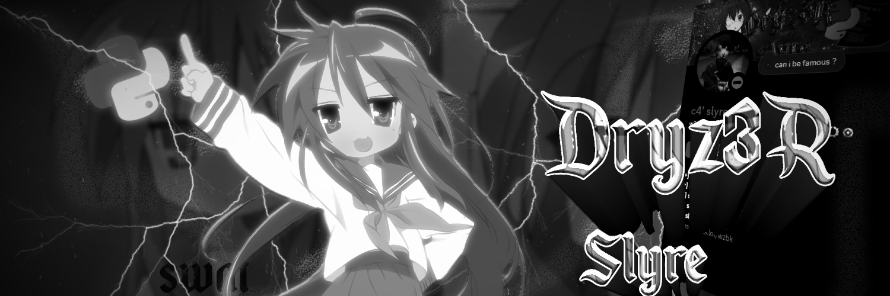

<div align="center">
  
  <br>
  
</div>

<h1 align="center">👋 Hello, I'm Dryz3R / Slyre</h1>
<hr>

## 📖 À Propos de Moi

```javascript
const Dryz3R = {
  pronouns: "il" | "lui",
  code: ["Python", "JavaScript", "PHP", "HTML/CSS"],
  technologies: {
      webScraping: ["Selenium", "BeautifulSoup", "Scrapy", "Playwright", "etc etc in c++"],
      automation: ["Puppeteer", "AutoHotkey", "Tasker"],
      database: ["MySQL", "SQLite", "MongoDB","and more"],
  },
  hobbies: ["Coding", "Gaming", "Cyber", "Robotic"]
};
```

<hr>

<div align="center">
  <a href="https://www.scraphub.org" target="_blank">
    
  </a>
  <br>
  <p>Découvrez <a href="https://www.scraphub.org" target="_blank"><b>Scraphub</b></a> pour vos meilleurs scrapes et automatisations.</p>
</div>

<hr>

## 📊 Statistiques GitHub

<div align="center">
  
  
  <br>
  
</div>

<hr>

## 🎴 Mes Projets

### 🔥 Projets Populaires

<div align="center">
  <table>
    <tr>
        <td>
      #COME SOON
        </td>
    </tr>
  </table>
</div>

### 🚧 Projets à Venir

<h3 align="center">COME SOON</h3>

<hr>

## 📞 Contact

<div align="center">
  <p>N'hésitez pas à me contacter pour discuter de collaborations ou de projets!</p>
  <a href="https://discord.gg/snaDSfj6" target="_blank">
    
  </a>
</div>

<hr>

<div align="center">
  <h2>📌 Abonnez-vous à mon GitHub</h2>
  <a href="https://github.com/Dryz3R?tab=followers" target="_blank">
    
  </a>
  <br>
  
</div>
